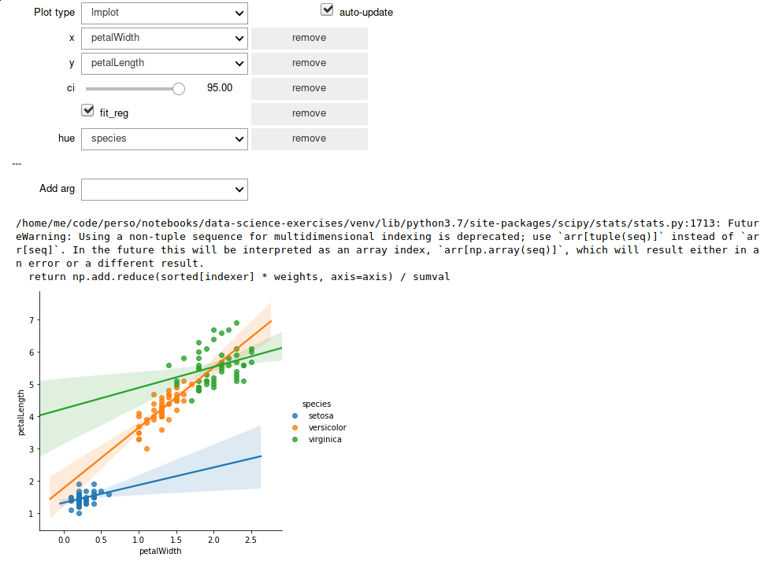

Quickviz
========

Quickviz provides widgets for quickly visualizing pandas dataframes. It
interfaces with seaborn and pandas.plot.

Example
-------

See the
[gallery](https://nbviewer.jupyter.org/github/chmduquesne/quickviz/tree/master/quickviz/tests/seaborn/)
(which is also a test suite) for more.

Usage
-----

There only one function, visualize. Apply it to your dataframe, and start
playing.

    from quickviz import visualize as v
    from vega_datasets import data

    df = data.cars()
    v(df)

[Try it live!](https://mybinder.org/v2/gh/chmduquesne/quickviz/master?filepath=examples/Tutorial.ipynb)

Rationale
---------

It is often necessary to plot data in order to understand it. Plotting
allows to quiclky spot glitches in the data: that person who is 180 meters
tall or this car which can speed thousands of kilometers per hour will
immediately stand out. In this situation, one wants a way to quickly
(rather than beautifully) plot their data. Quickviz provides a set of
widgets to do this in a few clicks.

Installation
------------

    pip install ipywidgets
    jupyter nbextension enable --py widgetsnbextension
    pip install quickviz

Disclaimer
----------

Quickviz does not read the documentation for you! It only makes it easier
to use seaborn/pandas with a mouse. In order to understand what you are
doing, you still need to dig in their respective APIs.
